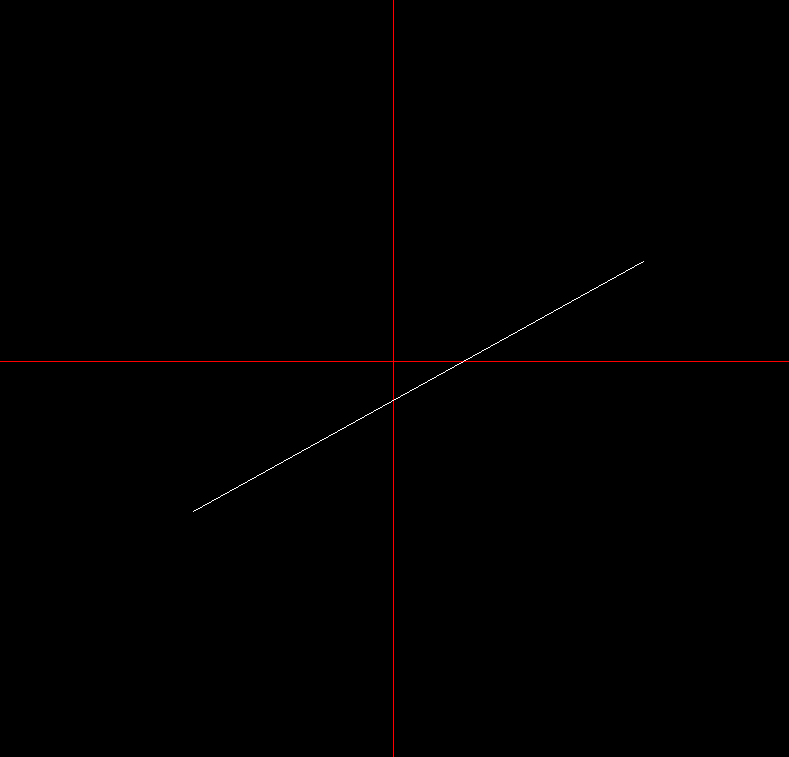

# Computer-Graphics-2D-Drawing

This program draw a...

1.Line (giving used to 2 points).

2.Circunference (giving the radius r).

3.Ellipse (giving value a and b).

4.Parabola (giving p).

5.Hyperbola (giving value a and b).

The drawing is generated by

# The Mid-Point Algorithm

made in C++
